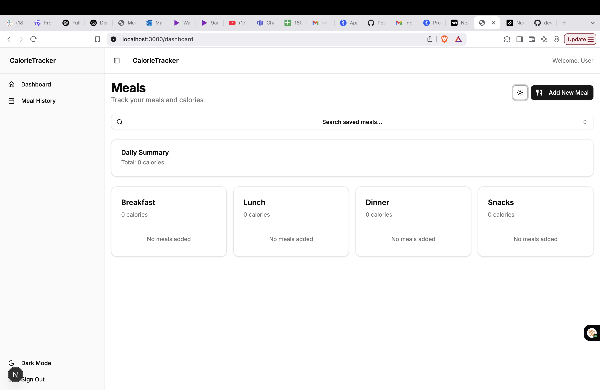
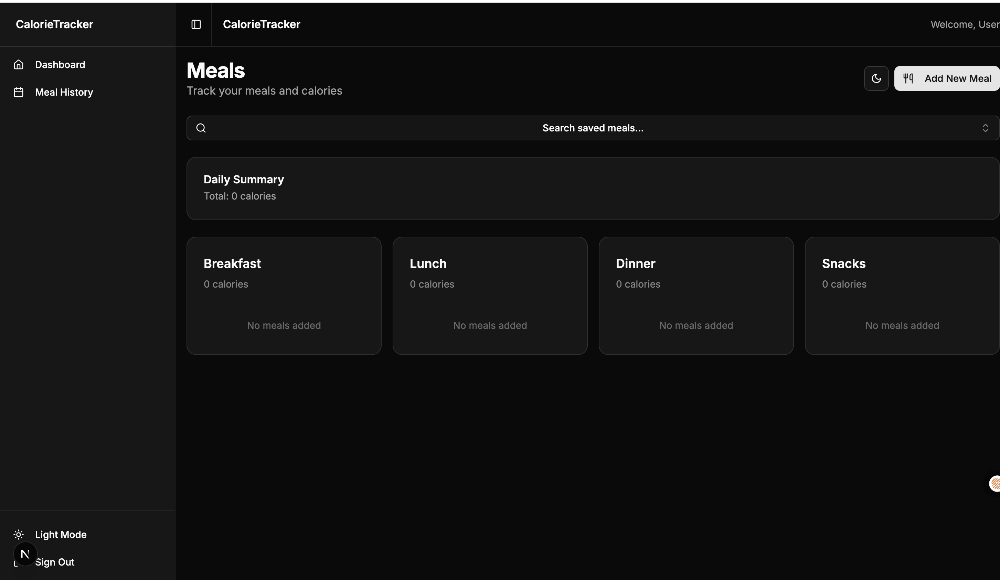
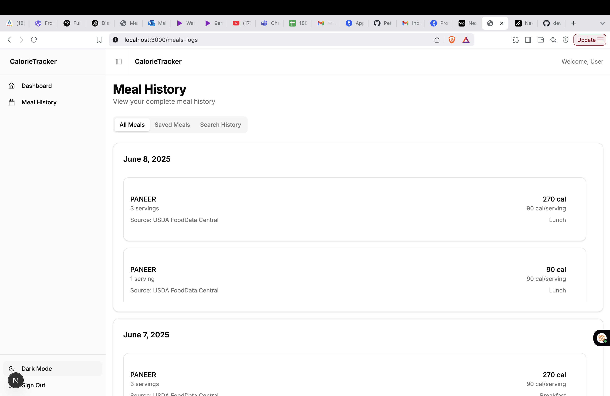
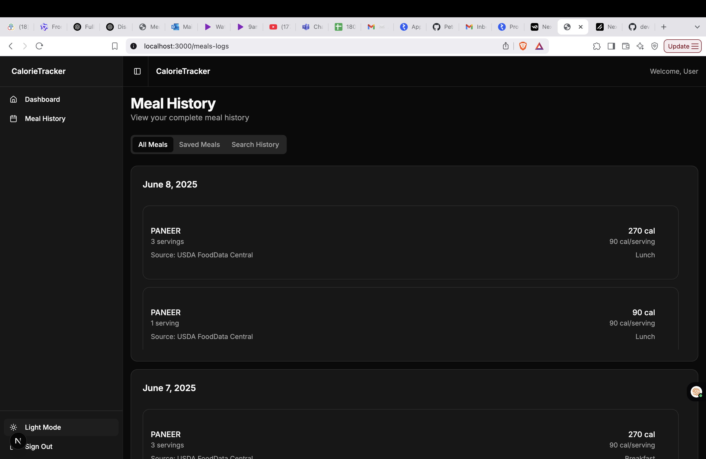
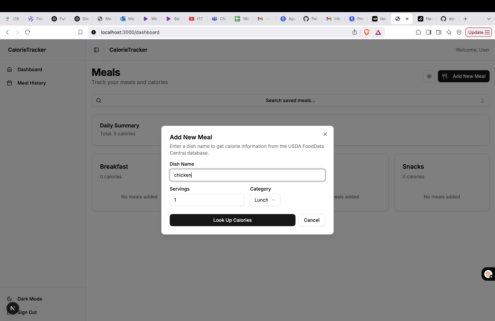
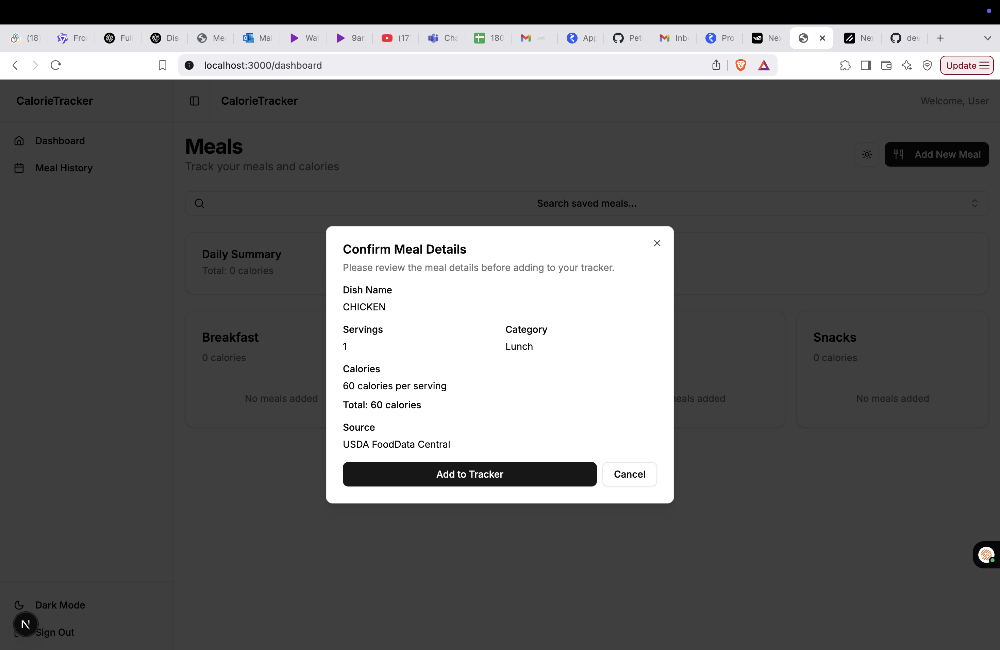

# Meal Calorie Tracker

A modern web application for tracking meals and calories, built with Next.js, TypeScript, and Tailwind CSS.



## Features

- 🔍 Search and track meals with calorie information
- 📊 Daily calorie summary
- 📱 Responsive design
- 🌙 Dark mode support
- 📝 Meal history tracking
- 🔄 Real-time updates
- 💾 Persistent storage

## Tech Stack

- **Framework**: Next.js 14 with App Router
- **Language**: TypeScript
- **Styling**: Tailwind CSS with shadcn/ui components
- **State Management**: Zustand with persistence
- **Form Handling**: React Hook Form with Zod validation
- **API Integration**: USDA FoodData Central API
- **Containerization**: Docker

## Setup Instructions

### Option 1: Local Development

1. Clone the repository:
   ```bash
   git clone https://github.com/devil94101/meal-calorie-frontend-deepak.git
   cd meal-calorie-frontend-deepak
   ```

2. Install dependencies:
   ```bash
   npm install
   ```

3. Create a `.env` file based on `.env.example`:
   ```bash
   cp .env.example .env.local
   ```

4. Start the development server:
   ```bash
   npm run dev
   ```

5. Open [http://localhost:3000](http://localhost:3000) in your browser.

### Option 2: Docker Development

1. Clone the repository:
   ```bash
   git clone https://github.com/yourusername/meal-calorie-frontend.git
   cd meal-calorie-frontend
   ```

2. Build and start the Docker container:
   ```bash
   docker-compose up --build
   ```

3. Open [http://localhost:3000](http://localhost:3000) in your browser.

To stop the container:
```bash
docker-compose down
```

## Project Structure

```
├── app/                    # Next.js app directory
│   ├── (dashboard)/       # Dashboard routes
│   └── api/              # API routes
├── components/            # React components
├── lib/                  # Utility functions and services
│   ├── services/        # API services
│   └── store/           # Zustand store
└── public/              # Static assets
```

## Design Decisions & Trade-offs

### 1. State Management
- **Choice**: Zustand over Redux
- **Reason**: Simpler API, less boilerplate, built-in TypeScript support
- **Trade-off**: Less ecosystem compared to Redux

### 2. Form Handling
- **Choice**: React Hook Form with Zod
- **Reason**: Type-safe validation, better performance than Formik
- **Trade-off**: Learning curve for Zod schema definitions

### 3. UI Components
- **Choice**: shadcn/ui over Material-UI
- **Reason**: More customizable, better dark mode support
- **Trade-off**: Less mature ecosystem

### 4. Data Persistence
- **Choice**: Local storage via Zustand persist
- **Reason**: Simple, works offline
- **Trade-off**: Limited storage space, no cloud sync

### 5. API Integration
- **Choice**: USDA FoodData Central API

### 6. Containerization
- **Choice**: Docker with docker-compose
- **Reason**: Consistent development environment, easy setup
- **Trade-off**: Additional resource usage

## Screenshots

### Dashboard



### Meal History



### Add Meal



## Environment Variables

Create a `.env.local` file with the following variables:

```env
NEXT_PUBLIC_API_BASE_URL=http://localhost:8000
```

## Contributing

1. Fork the repository
2. Create your feature branch (`git checkout -b feature/amazing-feature`)
3. Commit your changes (`git commit -m 'Add some amazing feature'`)
4. Push to the branch (`git push origin feature/amazing-feature`)
5. Open a Pull Request

## License

This project is licensed under the MIT License - see the [LICENSE](LICENSE) file for details.
